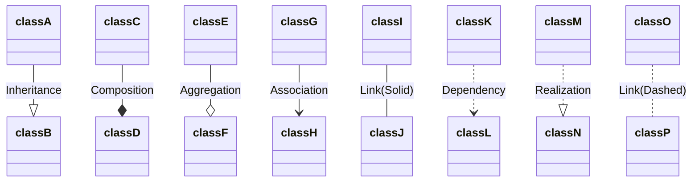

# 类图 Class Diagram<no value>

- ClassDiagram

## 0.1. UML 关系图

``` mermaid
classDiagram
classA --|> classB : Inheritance   
classC --* classD : Composition
classE --o classF : Aggregation
classG --> classH : Association
classI -- classJ : Link(Solid)
classK ..> classL : Dependency
classM ..|> classN : Realization
classO .. classP : Link(Dashed)

```
![[Pasted image 20230726101916.png]]
